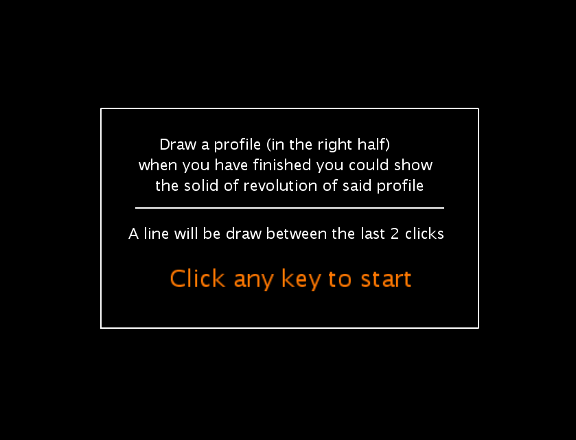
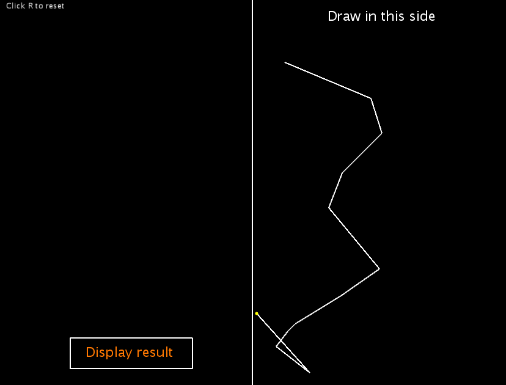
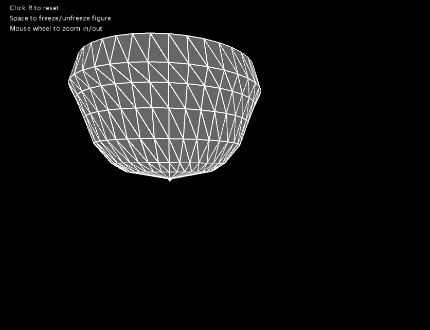

# Datos
Autor: Fernando Marcelo Alonso

Asignatura: Creando Interfaces de Usuario(CIU)

## Introducción
Esta prácitca consiste en realizar un programa que permita al usuario dibujar un perfil, a partir de dicho perfil se mostrará una superficie de revolución basada en dicho perfil.

## Implementación y argumentación

Para la implementación del juego he usado Processing 3.5.4.

**Menú:** Al ejecutar el programa lo primero que vemos es un pantalla que nos muestra información de como usar el programa, también se muestra como continuar a la siguiente pantalla que sería la de dibujo, como en esta pantalla no se pueden tomar más acciones que avanzar decidí que era adecuado que se pudiera avanzar pulsando cualquier tecla.

**Pantalla perfil:** La siguiente pantalla que nos encontramos nos muestra una lienzo dividido en 2, con información de como resetear el dibujo y un botón para mostrar la superficie de revolución del dibujo que hayamos realizado, decidí poner un botón para mostrar la superficie de revolución pues es una acción básica con lo que conviene que el usuario la vea de forma clara. También hay un mensaje informando al usuario de que debe dibujar en la mitad derecha de la pantalla.

**Mécaninca de dibujo:** Cada click que se realice sobre la pantalla se unira por una linea al anterior click realizado con lo que la figura será continua, como ayuda se muestra una linea entre el ultimo punto y el ratón para que se pueda visualizar como quedaría la linea si se clicará en cualquier punto, también se muestra un punto amarillo pequeño que apunta donde aterrizará el siguiente punto si clicamos, esto lo realice para que el usuario pueda ver de forma simple que si pulsa en el lado izquierdo de la pantalla el punto se dibujara en la mitad de la pantalla a la altura a la que se encuentra el ratón.

     
**Pantalla superficie de revolución:** Esta pantalla muestra la superficie de revolución del perfil dibujado por el usuario, arriba a la izquierda se muestran varios controles, coloqué en este lugar la información pues no molesta además que suele ser el sitio comun para mostrar información.

**Congelar/descongelar figura:** En la pantalla de superficie de revolución una de las acciones que se comunica al usuario es la posibilidad de congelar la figura para que no se mueva, dicha acción se realiza con el espacio, con la misma tecla se descongela la figura, cuando se encuentra congelada la figura esta no se mueve con el ratón si no que se mantiene quieta.

**Mover figura:** Con el ratón podremos mover la figura de forma libre permitiendo verla desde distintos ángulos, la figura sigue el moviento del ratón siempre y cuando no se encuentre congelada.

**Reset:** La opción de resetear se encuentra disponible en la Pantalla perfil y pantalla superficie de revolución, en ambos casos volvemos a la pantalla de perfil sin un perfil dibujado con lo que podremos realizar un perfil desde cero, el perfil realizado previamente no se guardará, elegi la letra r o R para reset simplemente por que es la inicial por la que empieza la plabra reset lo que facilita recordarlo

**Zoom:** En la información mostrada en la Pantalla superficie de revolución también se indica que se puede alejar o acercar la imagen con la rueda del ratón, la rueda hacia delantea acerca la imagen hacia atras la aleja, esta mecánica me parecio interesante pues permite poder ajustar el tamaño de la imagen si hubieramos realizado un perfil demasiado grande o demasiado pequeño para ser visualizado de forma correcta, opte por la rueda del ratón para realizar esta acción pues es muy intuitivo para el usuario dado que en casi todas las interfaces se usa de esta forma.

## Código

He optado por dejar el menor código posible en el método draw para usar métodos expecificos para el control de las distintas situaciones.

#### Variables:
+ **PShape figure:** la figra de la superficie de revolución.
+ **ArrayList<int[]> points:** Guarda las distintas puntos x, y que el usuario clique en la pantalla de dibujo del perfil.
+ **boolean created:** Almacena si la figura de revolución esta siendo mostrada.
+ **boolean freeze:** Guarda si la figura se encuentra congelada o no.
+ **int lastX, lastY:** Para poder dibujar la linea entre el último punto dibujado y el ratón tenemos que guardar donde fue el último lugar donde se encuentra el ratón.
+ **float scale:** Guarda el tamaño actual de la imagen, es decir lo escalada que se encuentra.
+ **int nStripes:** Número de franjas verticales a mostrar.
+ **boolean menuOn:** Indica si la pantalla de menú se encuentra activa o no.

#### Métodos:
+ **initFigure:** Resetea la figura a dibujar para poder dibujarla desde 0.
+ **menuScreen:** Muestra la pantalla de inicio o menú.
+ **drawScreen:** Se encarga de dibujar la pantalla de dibujo del perfil.
+ **figureScreen:** Dibuja la superficie de revolución.
+ **createVertex:** Añade los vertices a la figura cuando el usuario pulsa el botón para mostrar la figura.
+ **isMouseOnButton:** Este método se usa para saber si el mouse se encuentra encima del botón.
+ **mouseClicked:** Se usa en la pantalla de dibujo para detectar y añadir los clicks del usuario para la acción de dibujar o para pulsar el botón de mostrar figura.
+ **keyPressed:** Detecta si el usuario ha clicado alguna de las teclas que permiten realizar distintas acciones.
+ **mouseWheel:** En la pantalla de la superficie de revolución este método se encarga de detectar cuando el usuario quiere realizar un zoom in/out.
